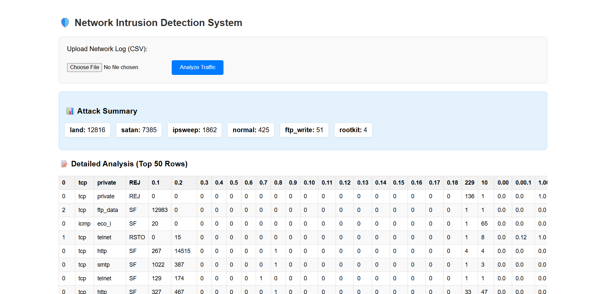

# network-ids-project
# 🛡️ Network Intrusion Detection System (NIDS)

An AI-powered web application that detects network attacks in real-time using Deep Learning.



## 🚀 Overview
This project automates cybersecurity threat detection. It analyzes network traffic logs (NSL-KDD dataset) and classifies connections as **Normal** or specific attacks like **DoS, Probe, R2L, and U2R**.

## 🛠️ Tech Stack
* **Python** (Core logic)
* **TensorFlow & Keras** (Deep Learning model)
* **Flask** (Web Interface)
* **Pandas & NumPy** (Data Preprocessing)

## 📂 Project Structure:
ids/
│
├─ data/
│   ├─ train.csv
│   └─ test.csv
│
├─ models/
│   ├─ ids_model.h5
│   ├─ scaler.pkl
│   └─ feature_columns.npy
│
├─ src/
│   ├─ __init__.py
│   ├─ preprocess.py
│   ├─ train.py
│   └─ predict.py
│
│
├─ templates/
│   └─ index.html
│
└─ app.py
## ⚡ How to Run
1.  **Clone the repository:**
    ```bash
    git clone (https://github.com/bechirch55/network-ids-project.git)
    cd network-ids-project
    ```
2.  **Install dependencies:**
    ```bash
    pip install -r requirements.txt
    ```
3.  **Run the application:**
    ```bash
    python app.py
    ```
4.  **Open in Browser:**
    Go to `http://127.0.0.1:5000`

## 📊 Model Performance
* **Accuracy:** ~99%
* **Loss:** ~0.05
* **Attacks Detected:** DoS, Probe, R2L, U2R, Normal

---
*Created by medbechirch - 2026*
